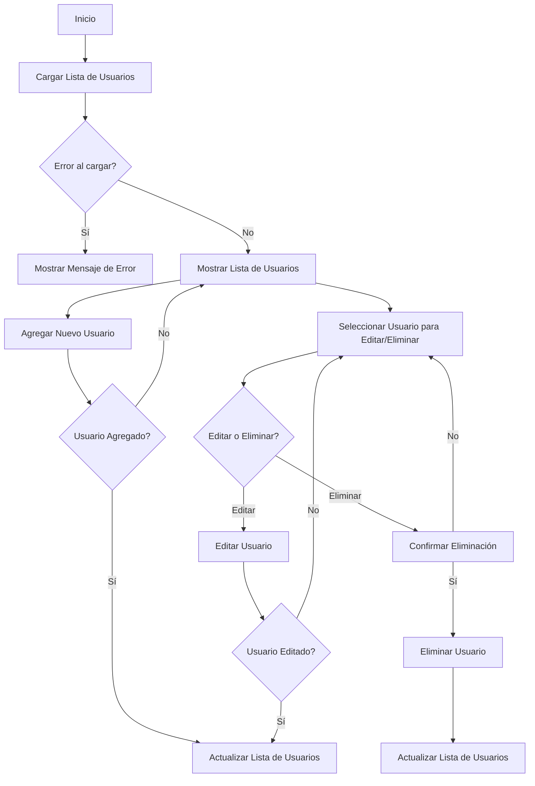
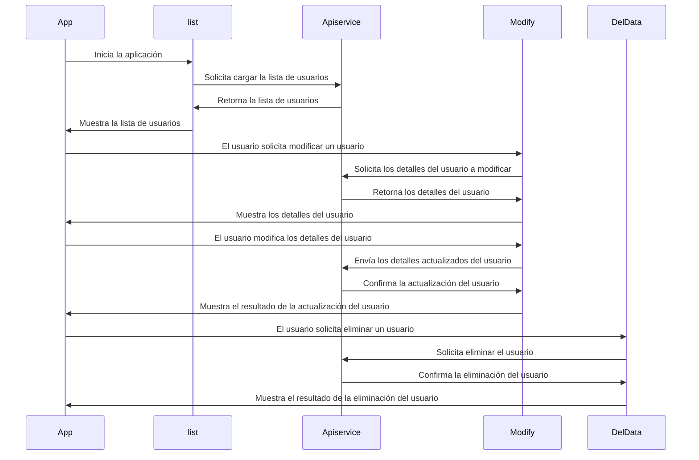

# Documentación de la Aplicación Flutter

## Introducción
Esta documentación detalla una aplicación Flutter que interactúa con una API para realizar operaciones CRUD (Crear, Leer, Actualizar, Eliminar) en una lista de usuarios. La aplicación consta de varios archivos organizados en una estructura de directorios.

## Estructura de Directorios
La aplicación sigue la siguiente estructura de directorios:

```
lib
  ├── model
  │   ├── api.dart
  │   ├── apilist.dart
  │   └── clslist.dart
  ├── services
  │   └── services.dart
  ├── view
  │   ├── delete.dart
  │   ├── list.dart
  │   ├── modify.dart
  │   └── main.dart
  └── main.dart
```

## Archivos y Funcionalidades

### 1. `lib/model/api.dart`
Este archivo define la clase `Utilapi`, que representa un modelo de datos para la API. Contiene los siguientes campos:
- `id`: Un entero que representa el ID del usuario.
- `name`: Una cadena que representa el nombre del usuario.
- `TpUser`: Un entero que representa el tipo de usuario.

Además, proporciona un constructor y un método de fábrica para crear instancias de `Utilapi` desde un mapa JSON.

### 2. `lib/model/apilist.dart`
En este archivo se encuentra la clase genérica `Apires`, que representa la respuesta de la API. Tiene los siguientes campos:
- `data`: Un tipo genérico `T` que representa los datos de la respuesta.
- `error`: Un booleano que indica si ocurrió un error.
- `errorMessage`: Una cadena que contiene un mensaje de error en caso de que ocurra un error.

### 3. `lib/model/clslist.dart`
Define la clase `Datasapi`, que es otro modelo de datos para la API. Contiene campos similares a `Utilapi` y también proporciona un método de fábrica para crear instancias desde un mapa JSON.

### 4. `lib/services/services.dart`
Contiene la clase `Apiservice`, que proporciona métodos para interactuar con la API. Estos métodos incluyen:
- `getApi()`: Obtiene la lista de usuarios desde la API.
- `getapi()`: Obtiene un usuario específico por su ID desde la API.
- `postNew()`: Envía un nuevo usuario a la API.
- `putUpdate()`: Actualiza un usuario existente en la API.
- `delDelete()`: Elimina un usuario de la API.

### 5. `lib/view/delete.dart`
Este archivo define el widget `DelData`, que muestra un diálogo de advertencia para eliminar un usuario. Permite al usuario confirmar o cancelar la eliminación.

### 6. `lib/view/list.dart`
El widget `list` muestra una lista de usuarios obtenida de la API. Permite al usuario agregar, modificar y eliminar usuarios. También muestra un indicador de carga mientras se obtienen los datos y maneja los errores de la API.

### 7. `lib/view/modify.dart`
El widget `Modify` es una pantalla para modificar o crear un nuevo usuario. Permite al usuario ingresar detalles como nombre y tipo de usuario, y luego realizar acciones como agregar un nuevo usuario o actualizar uno existente.

### 8. `lib/main.dart`
Este es el punto de entrada de la aplicación Flutter. Configura los servicios y define el widget principal de la aplicación.

## Diagrama de Clases
```mermaid
classDiagram
    class Utilapi {
        id: int
        name: String
        TpUser: int
        Utilapi(id: int, name: String, TpUser: int)
        +fromJson(json: Map<String, dynamic>): Utilapi
    }

    class Apires<T> {
        data: T
        error: bool
        errorMessage: String
        Apires(data: T, error: bool, errorMessage: String)
    }

    class Datasapi {
        id: int
        name: String
        TpUser: int
        Datasapi(id: int, name: String, TpUser: int)
        +fromJson(json: Map<String, dynamic>): Datasapi
    }

    class Apiservice {
        ip: String
        app: String
        headers: Map<String, String>
        +getApi(): Future<Apires<List<Datasapi>>>
        +getapi(String i): Future<Apires<Utilapi>>
        +postNew(String a, String b): bool
        +putUpdate(String a, String b, String c): bool
        +delDelete(String a): bool
    }

    class DelData {
        id: int
        DelData(id: int)
    }

    class list {
        -service: Apiservice
        -isLoading: bool
        -apires: Apires<List<Datasapi>>
        +initState()
        +_fetchDatas()
        +build(BuildContext context): Widget
    }

    class Modify {
        -_isEditing: bool
        -serv: Apiservice
        -errorMessage: String
        -api: Utilapi
        -send: String
        -title: String
        -_namectl: TextEditingController
        -_contctl: TextEditingController
        -_isLoading: bool
        +initState()
        +build(BuildContext context): Widget
    }

    class App {
        +build(BuildContext context): Widget
    }

    Utilapi <-- Apires
    Utilapi <-- Datasapi
    Apires <-- list
    Apiservice <-- list
    list <-- Modify
    Modify <-- DelData
    Modify <-- Apiservice
    App --> list
```
## Diagrama de Flujo

## Diagrama de Sequencia

## Conclusiones
La aplicación Flutter proporciona una interfaz de usuario para interactuar con una API de usuarios, permitiendo realizar operaciones CRUD de manera intuitiva y eficiente.